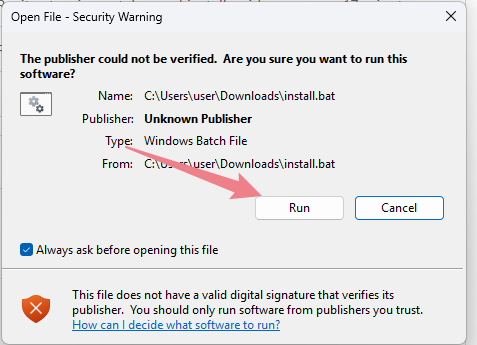
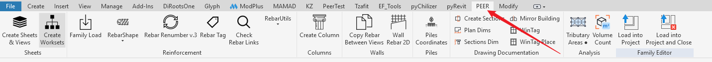
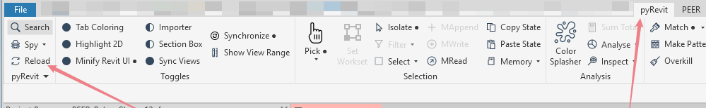

# PEER for Revit — Installation

You need: Revit and [pyRevit](https://github.com/pyrevitlabs/pyRevit/releases). Git is not required.

## Install (once)

**1.** Close Revit.

**2.** Download **[PEER_install.zip](https://github.com/Danilchenko79/PyRevit/raw/main/PEER_install.zip)** and open it.

**3.** Double-click **install.bat** inside the zip. If Windows shows a security warning, click **Run**.

*Figure 1 — Windows security warning: click Run*

**4.** Wait for `[OK]`, then press any key.

**5.** Start Revit — the **PEER** tab appears.

*Figure 2 — PEER tab in the Revit ribbon*

## Updates

Updates install automatically every time Revit starts.
To update without restarting Revit, click **pyRevit → Reload**.

*Figure 3 — Reload button on the pyRevit tab*

## Troubleshooting

- **No PEER tab** — restart Revit.
- **Updates stopped** — close Revit and run `install.bat` again.
- **`Could not download` error** — check that github.com opens in your browser.

Do not edit files in the extension folder, or updates will stop working.

## Uninstall

Close Revit and delete the folder `%APPDATA%\pyRevit\Extensions\PEER.extension`.
